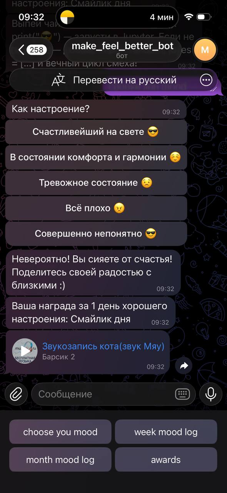
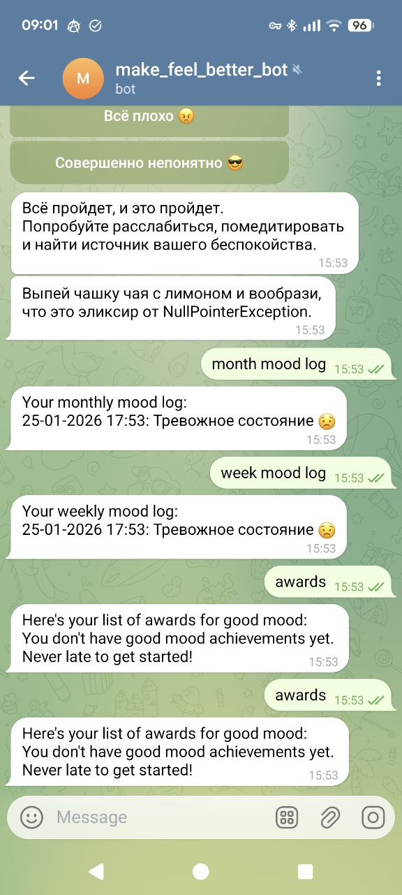

[English version](https://github.com/KatyaBahai/job4j_boost_mood_bot/blob/main/README.md#english-version)

## Job4j Boost Mood Bot

Telegram-бот для отслеживания ежедневного настроения, ведения дневника настроения и отправки мотивационных наград (аудио, фото, текст) при достижении последовательности хороших дней. Главная цель: стать другом в кармане, который поднимает настроение с помощью юмора, сочувствия и поддержки.

## Функциональность: 

- Регистрация пользователей: Новые пользователи регистрируются командой /start.

- Ежедневная запись настроения: Выберите своё настроение.

- История настроения: Просмотр лога настроения за последнюю неделю (/week) или месяц (/month).

- Награды: Автоматические награды за последовательные дни хорошего настроения.

- Поднимаем настроение: По запросу — юмор, аудио и визуальный контент для поднятия духа.

## Инструкции по установке:
- Склонируйте репозиторий:
```
git clone <repository-url>
```
- Получите токен бота:
Напишите @BotFather в Telegram

/newbot → следуйте инструкциям → скопируйте токен
- Отредактируйте src/main/resources/application.properties, добавив свой токен Telegram-бота:
```
telegram.bot.token=.....
```
- Запустите приложение одним из следующих способов:
* Через основной класс:
  
Перейдите в src/main/java/ru/job4j/bmb и запустите класс Main.

* Через Maven:
* 
Скомпилируйте и запустите проект командой:
```
mvn spring-boot:run
```
- Откройте своего бота в Telegram и нажмите start!

## Используемые технологии
- Java 21
- Spring Boot 3.3.3
- H2(встроенная) + Spring Data JPA
- telegrambots 6.9.7.1
- JUnit 5, Mockito, AssertJ
- Checkstyle 10.3.3
- Lombok, AOP

## Контакты
Катя Щербакова

Для связи в Telegram: @Midori_Sun


### English version:

## Job4j Boost Mood Bot

A Telegram bot designed to track your daily mood, log entries, and send motivational rewards (audio, photos, text) when you hit streaks of good mood days. Its ultimate goal: be the friend in your pocket that brightens your day with humor, sympathy, and support.

### Features
- User Registration: New users register with /start.
- Daily Mood Logging: Choose your mood.
- Mood History: View your mood log for the last week (/week) or month (/month).
- Streak Rewards: Automatic awards for consecutive good mood days.
- Mood Boosters: On-demand humor, audio, and visual content to lift spirits.
  
### Installation Instructions

Follow these steps to run the project locally:

1) Clone the repository:
```
git clone <repository-url>
```
2) Get Bot Token:

Message @BotFather on Telegram

/newbot → follow prompts → copy token
3) Configure:
Edit src/main/resources/application.properties by adding your own Telegram bot token:
```
telegram.bot.token=.....
```
4) Launch the application:

You can start the application using one of the following methods:

- Using the Main class:

Navigate to src/main/java/ru/job4j/bmb and run the Main class.

- Via Maven:

Compile and run the project with:
```
mvn spring-boot:run
```
6) Access the application:

Open your bot on Telegram and press start!

### Technologies Used

Java 21

Spring Boot 3.3.3

H2 (embedded) + Spring Data JPA

telegrambots 6.9.7.1

JUnit 5, Mockito, AssertJ

Checkstyle 10.3.3

Lombok, AOP

### Contact
Katya Shcherbakova

You can reach out via Telegram: @Midori_Sun





